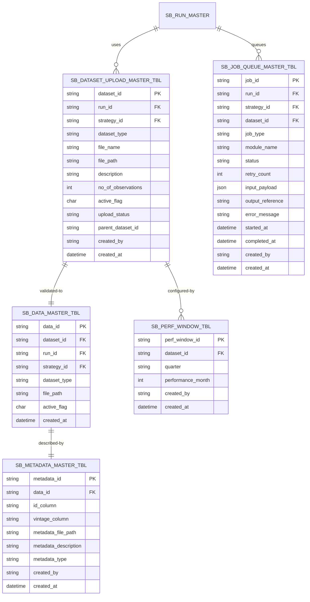

```mermaid
erDiagram
  SB_DATASET_UPLOAD_MASTER_TBL {
    string dataset_id PK
    string run_id FK
    string strategy_id FK
    string dataset_type
    string file_name
    string file_path
    string description
    int no_of_observations
    char active_flag
    string upload_status
    string parent_dataset_id
    string created_by
    datetime created_at
  }
  SB_DATA_MASTER_TBL {
    string data_id PK
    string dataset_id FK
    string run_id FK
    string strategy_id FK
    string dataset_type
    string file_path
    char active_flag
    datetime created_at
  }
  SB_METADATA_MASTER_TBL {
    string metadata_id PK
    string data_id FK
    string id_column
    string vintage_column
    string metadata_file_path
    string metadata_description
    string metadata_type
    string created_by
    datetime created_at
  }
  SB_PERF_WINDOW_TBL {
    string perf_window_id PK
    string dataset_id FK
    string quarter
    int performance_month
    string created_by
    datetime created_at
  }
  SB_JOB_QUEUE_MASTER_TBL {
    string job_id PK
    string run_id FK
    string strategy_id FK
    string dataset_id FK
    string job_type
    string module_name
    string status
    int retry_count
    json input_payload
    string output_reference
    string error_message
    datetime started_at
    datetime completed_at
    string created_by
    datetime created_at
  }
  SB_RUN_MASTER ||--o{ SB_DATASET_UPLOAD_MASTER_TBL : uses
  SB_DATASET_UPLOAD_MASTER_TBL ||--|| SB_DATA_MASTER_TBL : validated-to
  SB_DATASET_UPLOAD_MASTER_TBL ||--o{ SB_PERF_WINDOW_TBL : configured-by
  SB_DATA_MASTER_TBL ||--|| SB_METADATA_MASTER_TBL : described-by
  SB_RUN_MASTER ||--o{ SB_JOB_QUEUE_MASTER_TBL : queues
```
