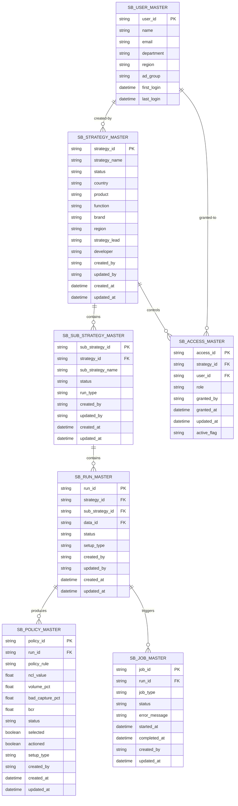

```mermaid
erDiagram
  SB_STRATEGY_MASTER {
    string strategy_id PK
    string strategy_name
    string status
    string country
    string product
    string function
    string brand
    string region
    string strategy_lead
    string developer
    string created_by
    string updated_by
    datetime created_at
    datetime updated_at
  }
  SB_SUB_STRATEGY_MASTER {
    string sub_strategy_id PK
    string strategy_id FK
    string sub_strategy_name
    string status
    string run_type
    string created_by
    string updated_by
    datetime created_at
    datetime updated_at
  }
  SB_RUN_MASTER {
    string run_id PK
    string strategy_id FK
    string sub_strategy_id FK
    string data_id FK
    string status
    string setup_type
    string created_by
    string updated_by
    datetime created_at
    datetime updated_at
  }
  SB_ACCESS_MASTER {
    string access_id PK
    string strategy_id FK
    string user_id FK
    string role
    string granted_by
    datetime granted_at
    datetime updated_at
    string active_flag
  }
  SB_POLICY_MASTER {
    string policy_id PK
    string run_id FK
    string policy_rule
    float ncl_value
    float volume_pct
    float bad_capture_pct
    float bcr
    string status
    boolean selected
    boolean actioned
    string setup_type
    string created_by
    datetime created_at
    datetime updated_at
  }
  SB_JOB_MASTER {
    string job_id PK
    string run_id FK
    string job_type
    string status
    string error_message
    datetime started_at
    datetime completed_at
    string created_by
    datetime updated_at
  }
  SB_USER_MASTER {
    string user_id PK
    string name
    string email
    string department
    string region
    string ad_group
    datetime first_login
    datetime last_login
  }
  SB_STRATEGY_MASTER ||--o{ SB_SUB_STRATEGY_MASTER : contains
  SB_SUB_STRATEGY_MASTER ||--o{ SB_RUN_MASTER : contains
  SB_STRATEGY_MASTER ||--o{ SB_ACCESS_MASTER : controls
  SB_RUN_MASTER ||--o{ SB_POLICY_MASTER : produces
  SB_RUN_MASTER ||--o{ SB_JOB_MASTER : triggers
  SB_USER_MASTER ||--o{ SB_ACCESS_MASTER : granted-to
  SB_USER_MASTER ||--o{ SB_STRATEGY_MASTER : created-by
```
